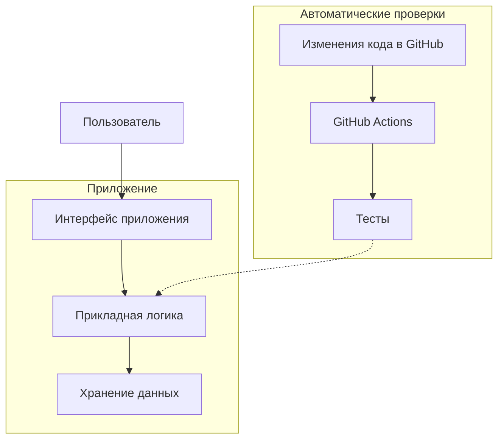

# 🎓 mag-progINJ — Программная инженерия

**РТУ МИРЭА · Магистратура · Учебный проект**

Добро пожаловать в репозиторий практических работ по дисциплине **«Программная инженерия»**. Здесь хранятся документация проекта, материалы лабораторных работ и история их изменений.

📖 [Начало работы](docs/Начало-работы.md) · 🛠 [Окружение разработки](docs/Окружение-разработки.md) · 📅 [Предстоящие события](docs/Предстоящие-события/README.md) · 🧩 [Архитектура](docs/architecture.md)

---

## 📋 Описание проекта

Цель проекта — освоить основные практики программной инженерии на примере учебного репозитория:

- управление версиями с помощью **Git и GitHub**;
- оформление проектной документации в **Markdown**;
- организация структуры проекта и навигации между документами;
- фиксация изменений понятными коммитами;
- постановка задач и подготовка материалов к проверке.

**Текущий этап:** подготовка структуры и документации. Предметная область приложения и его технологический стек будут определены в следующих практических работах.

## 🗂 Навигация по документации

| Раздел | Содержание |
| --- | --- |
| [Начало работы](docs/Начало-работы.md) | Знакомство с репозиторием, получение локальной копии и первое изменение |
| [Окружение разработки](docs/Окружение-разработки.md) | Инструменты для работы через браузер и локально |
| [Структура и архитектура](docs/architecture.md) | Организация документации и план расширения проекта |
| [Предстоящие события](docs/Предстоящие-события/README.md) | Учебный план работ: [январь](docs/Предстоящие-события/События-Января.md), затем [февраль](docs/Предстоящие-события/События-Февраля.md) |
| [История изменений](https://github.com/Sailats/mag-progINJ/commits/main/) | Сохранённые версии файлов и сообщения коммитов |

## 🛠 Структура и архитектура проекта

Текущая структура репозитория:

```text
mag-progINJ/
├── docs/
│   ├── Начало-работы.md          # Знакомство с проектом
│   ├── Окружение-разработки.md   # Инструменты и подготовка среды
│   ├── architecture.md          # Структура и план развития
│   └── Предстоящие-события/
│       ├── README.md            # Навигация по плану мероприятий
│       ├── События-Января.md     # План на январь
│       ├── События-Февраля.md    # План на февраль
│       └── .order               # Учебный файл порядка страниц
└── README.md                    # Главная страница проекта
```

Документация организована как связанные Markdown-страницы: `README.md` служит точкой входа, а подробные инструкции находятся в каталоге `docs/`. Планируемая структура исходного кода описана в [документе об архитектуре](docs/architecture.md#план-развития-структуры).

### 📊 Планируемая схема компонентов

Схема описывает предполагаемое взаимодействие приложения и автоматических проверок. Компоненты и технологический стек будут уточняться после выбора темы приложения.



## 👥 Команда проекта

| Участник | Участие в проекте | Состояние доступа |
| --- | --- | --- |
| [@Sailats](https://github.com/Sailats) | Владелец и автор учебного проекта | Администратор |
| [@lksndrvvv](https://github.com/lksndrvvv) | Коллега по лабораторной работе | Присоединился, права `Write` |
| [@mifoxti](https://github.com/mifoxti) | Коллега по лабораторной работе | Приглашён с правами `Write`, ожидается принятие |
| [@Youdzter-Utka](https://github.com/Youdzter-Utka) | Коллега по лабораторной работе | Приглашён с правами `Write`, ожидается принятие |

Приглашения отправлены трём коллегам. Статус в таблице зафиксирован на 15 сентября 2026 года; актуальный доступ владелец проверяет в **Settings → Collaborators**.

## 🚀 Статус выполнения задач

- [x] Создан репозиторий учебного проекта.
- [x] Оформлена главная страница `README.md`.
- [x] Добавлены страницы начала работы, окружения и архитектуры.
- [x] Настроена навигация между документами.
- [x] Добавлены события января и февраля с заданным порядком чтения.
- [x] Добавлена диаграмма Mermaid с планируемыми компонентами.
- [x] Изменение окружения разработки оформлено отдельным коммитом.
- [x] Приглашены три коллеги по лабораторной работе.
- [ ] Определить предметную область и требования к приложению.
- [ ] Выбрать технологический стек и добавить исходный код.
- [ ] Подготовить проверки для реализованных функций.

Предложения, замечания и задачи можно оформлять в разделе [Issues](https://github.com/Sailats/mag-progINJ/issues). Изменения файлов сохраняются коммитами и доступны в [истории репозитория](https://github.com/Sailats/mag-progINJ/commits/main/).

### 🔎 Пример изменения документации

В странице «Окружение разработки» уточнены права участников и добавлена проверка подключения к GitHub. [Открыть коммит и сравнение версий](https://github.com/Sailats/mag-progINJ/commit/f924b55).

## ✍️ Правила работы с документацией

1. Перед изменениями изучить существующую структуру и соответствующий раздел.
2. Оформлять текст заголовками, списками, таблицами и блоками кода Markdown.
3. Использовать относительные ссылки для переходов между файлами репозитория.
4. Проверять предварительный просмотр и ссылки перед сохранением.
5. Сопровождать коммит кратким описанием изменения, например:

   ```text
   docs: уточнить окружение разработки
   ```

---

**Автор:** [@Sailats](https://github.com/Sailats) · **Дисциплина:** «Программная инженерия» · **Университет:** РТУ МИРЭА
